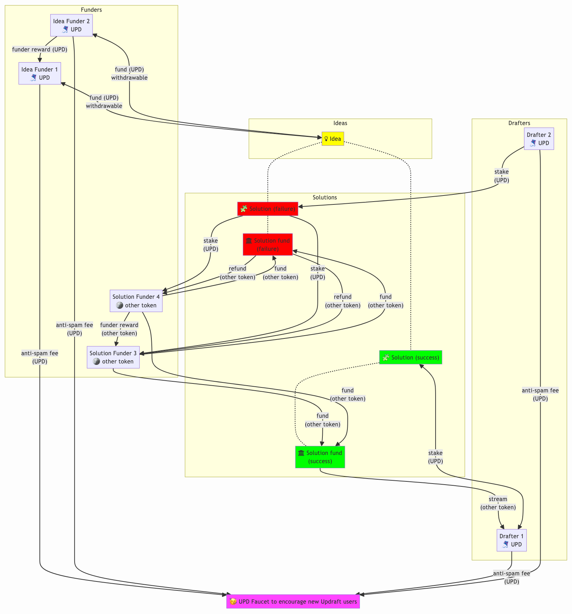

# 🪁Updraft

Get paid to crowdfund and work on public goods.

## How it works

### Support ideas

Post an idea that would make your community or the world better. Support other people's ideas. If your idea or an idea you supported receives more support, you earn money.

Ideas with the most support rise to the top and receive more views from the public and solution providers (drafters).

### Support solutions

Drafters propose solutions to ideas and optionally stake their own funds that their solutions will reach their support goals.

If a solution doesn't reach its support goal, funders receive a refund from the solution fund plus a portion of the drafter's stake. If the solution reaches its goal, congratulations!--you helped build something that will make the world better.

You also earn money from any support that comes after yours. A drafter can continue to receive support and add more goals while early funders continue to earn.

Funding flow diagram ([Link to larger version with explanations](https://hackmd.io/VAIblnwwRwCUA1bkUEli8A))

## Vision

Public goods will be as easy to fund as for-profit ventures. DAOs, grant-makers and philanthropists will route all their ideas and proposals through Updraft to engage a larger community for support, feedback and solutions.

## Why it works

Funding public goods suffers from three problems:

1. Preference revelation. Public goods are free; without a market it's hard to know the value of a public good and which people will benefit from it.
2. Free-riding. If someone expects a public good to be fully funded, they could try to save their money and let others pay for it. This loophole can result in an important public good never being provided or its providers being underpaid.
3. Assurance. Even if someone is willing to pay for a public good, they may be reluctant to support a solution that might fail if others don't also support it. These doubts compound in a negative feedback loop.

Updraft gets closer than other systems to solving the preference revelation problem by attraction attention through the possibility of a reward. This is a superior system than polling or voting in which the value of a single vote is negligible and rarely worth the effort to research different options.

The possibility of a reward also means that more people that would free ride are impelled to instead add their own support at a level they can afford. Even those that overpay (compared to the per-person value of the public good, but still within their personal budget) can feel good knowing that their favored solution was fully funded and the public good they care about will be available to more people.

Updraft is a [dominant assurance contract](https://en.wikipedia.org/wiki/Assurance_contract#Dominant_assurance_contracts), meaning that the *dominant* strategy for potential funders is to always fund the public good. This in turn encourages more funders, bringing down the per-person cost of funding. The dual prospects of winning a drafter's stake or contributing early and earning from follow-on supporters are a powerful motivation to fund underfunded goods.

## Decentralization

Updraft must be completely open-source and easy to fork. Some members of the global community might not like the team's decisions, or they may prefer a different front-end. Anyone should be allowed to create their own version and manage it with their own team as they please.

Updraft can fund more than pure public goods. Any project can make themselves more like a public good by using Updraft to open work items as bounties. Drafters can start working on bounties even before they reach their funding goal, posting updates on their progress. Staking is always optional for solutions and may not be useful for bounties.

## Details

Updraft is built using [attention streams](https://docs.google.com/document/d/1TKA-K8YadRdgz-Qek01TUcCkRaI9CKCXGtJ31AbVWIU/edit?tab=t.0#heading=h.c8wdt9uwyj7r).

Support for ideas are paid in Updraft tokens(UPD). Idea creators set the *contributor fee* for their idea as a percentage. This goes to previous funders of the idea. The idea creator doesn't need to pay the contributor fee. Both idea creators and contributors pay an anti-spam fee[^1](in UPD). The rest of a contribution is stored and used to determine future earnings as follow-on support comes in. The contribution and earnings can be withdrawn at any time; this encourages funders to reduce support for stale ideas. Ideas with the highest *interest* (total shares generated; called "relative support" in the Attention Streams doc) are sorted at the top of the default ordering and searches in Updraft.

A drafter pays an anti-spam fee[^1] (in UPD), sets a funding deadline, a stake amount (also in UPD), a funding goal (in a token they choose), and a contributor fee. Solution funders pay the contributor fee to previous funders. What remains goes to a locked solution fund. If the goal isn't reached by the deadline, the stake is paid to solution funders (split in proportion to shares, just like contributor fees) and all contributions to the solution fund are refunded.

Funders can also add any amount to the drafter's stake to attract follow-on supporters; they will get their full stake back if the solution reaches its goal and part of it back (since it's split among funders) if it doesn't.

After a goal is reached, funders can still make contributions (from which they still pay contributor fees). A drafter can extend their solution with a new goal, stake, and deadline to continue to fund their efforts.

When creating a solution, the drafter sets the following parameters:
* contributor fee % paid to solution funders. (This isn't paid by or earned by the drafter.)
* funding deadline
* stake amount
* funding goal
* funding token

[Aura](https://brightid.gitbook.io/aura) players in the Updraft domain create score cards rating drafters on how well they implemented their solution and how effective it was in achieving the parent idea. (See Future Features for more about Aura score cards.)

## Future features

### Report and hide spam

Ideas and solutions have a "report spam" button. If an idea or solution is reported N times it is hidden by default. The Updraft team can review hidden ideas and solutions and whitelist them (which will permanently unhide them) if appropriate. There should also be a checkbox to "show hidden items."

### Search, sort and filter

#### Search by id
Each idea or solution should have a human-readable id so people can recommend ideas and solutions to each other and make sure they find the right one (since ideas or solutions could have similar names but different parameters).

#### Text search
Search for words in the name or description.

#### Sort
The default can be "hot" or "trending" which means new and popular. There can also be "top" or "popular". Finally, "new" is another sort.

#### Filters
* Solutions (filter to only show ideas with solutions)
  * Solution funding > X (find well funded solutions)
  * Ending soon (solutions about to reach the deadline and fail their goal)
  * Interest (cost per 1% share) < X (find a solution that doesn't have a lot of support yet)
* Ideas
  * Interest (cost per 1% share) < X (find an idea that doesn't have a lot of support yet)

### Trending ideas

Once they're done checking activity (so maybe on the Activity page), I think it'd be cool to show them if they are any new ideas (especially "hot" ideas that are new and rising quickly).

### Ideas for you

Recommendation engine to show ideas similar to ones they've supported in the past, or suggest ideas based on cohort analysis (e.g. you supported idea X; people who supported X also supported Y, therefore we will show you Y).

The "Ideas for you" section could feature prominently on the main page.

### Spam filter fee set by community

Set the spam filter fee amount using a continuous median vote. Anyone who is Aura verified as a unique human is eligible to vote.

### Streaming and claw-back

A solution can set up their solution fund to stream once the goal is reached to make it more attractive to contributors.

A drafter can set a stream rate for their solution. This allows contributors  to monitor progress on the implementation and claw back part of their contributions if they aren't satisfied.

Any time after a solution reaches its goal, if enough funders (whose contributions total more than half of the goal) vote to reject it, the stream will be stopped and anything left in the fund will be returned to funders proportional to their contributions.

### Comments

Allow anyone to comment on ideas and solutions. This will require moderation.

### Aura scorecards

#### Benefits

* People will trust solutions more and be more willing to add follow-on support if they see positive score cards for drafters and funders.
* Drafters and funders could be exempt from anti-spam fees if they have a (revokable or expirable) badge from Aura.

#### For solutions

[Aura](https://brightid.gitbook.io/aura) scorecards for the solutions, where experts evaluate the validity and impact of solutions, the track record of drafters, and sniff out scams.

They can also report on solution impact and idea-solution fit.

#### For drafters

Drafters that create multiple solutions can request their own score cards.

#### For funders

Frequent funders (DAOs, philanthropists, grant-makers) can also request to have their own score cards.

## UPD Tokens

Fixed supply of 100B UPD.

80B UPD will go into liquidity pools so anyone can buy UPD.

### Updraft Council

10B UPD will go to the Updraft Council safe with a mandate to fund ideas and solutions on Updraft.

### Founding Team

10B UPD will be go to the founding team, who agree to spend the majority funding ideas and solutions on Updraft or donating to the Humanity Fund.

### Humanity Fund

All fees will go to [Unitap](https://unitap.app) to be distributed to humanity as a universal dividend.

[^1]: The anti-spam fee for an idea is the greater of a % fee (e.g. 0.3%) and a low fixed fee (e.g. $0.10). Both are set by the Updraft team. This % fee discourages someone from contributing to their own idea just to boost it in the sort order. Drafters pay a low, fixed anti-spam fee set by the Updraft team.
